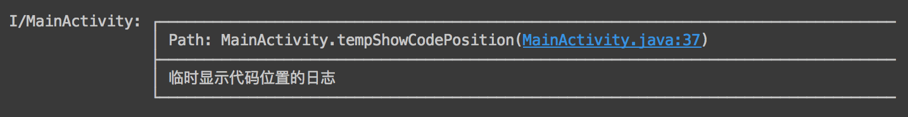

# AndroidLog 

<a href="http://www.methodscount.com/?lib=com.github.twiceyuan%3AAndroidLog%3A1.0.1"></a>
[](https://jitpack.io/#twiceyuan/AndroidLog)


一个类实现更实用的 Android Log 工具 —— 1 个类，100 个方法、9 KiB

* [x] 自动获得当前代码所在的类作为 TAG
* [x] 提供全局和局部的日志配置、开关
* [x] 定位日志打印所在的代码位置
* [x] JSON 的美化显示
* [ ] TODO

## 使用

1. JitPack https://jitpack.io/#twiceyuan/AndroidLog
2. 直接拷贝[类文件](library/src/main/java/com/twiceyuan/log/L.java)

### 普通打印日志
```java
L.i("一条普通的日志，类型 INFO");
L.v("一条普通的日志，类型 VERBOSE");
L.w("一条普通的日志，类型 WARNING");
L.e("一条普通的日志，类型 ERROR");
L.wtf("一条普通的日志，类型 WTF");
```
输出 其中 MainActivity 的 Tag 为自动获得当前类的名称


### 带代码位置的日志
```java
L.showPath().i("临时显示代码位置的日志");
```
输出 在 Android Studio 下可以根据输出跳转（同输出异常 stack）



### 输出格式化的 JSON
```java
L.json("{\"status\": 200,\"data\": {\"key\": \"value\"}}");
```
输出


### 获得一个局部使用的日志器
```java
L.createLogger();
```
获取后可以设置该日志器的私有配置、控制该日志器下的日志开关

### 配置默认日志器
```java
L.getDefaultLogger();
```
使用该日志器进行的修改作为默认日志器的配置，直接使用 L 调用的方法都将应用这个配置，并且作为创建局部日志器的默认配置

## License

```
MIT License

Copyright (c) 2016 twiceYuan

Permission is hereby granted, free of charge, to any person obtaining a copy
of this software and associated documentation files (the "Software"), to deal
in the Software without restriction, including without limitation the rights
to use, copy, modify, merge, publish, distribute, sublicense, and/or sell
copies of the Software, and to permit persons to whom the Software is
furnished to do so, subject to the following conditions:

The above copyright notice and this permission notice shall be included in all
copies or substantial portions of the Software.

THE SOFTWARE IS PROVIDED "AS IS", WITHOUT WARRANTY OF ANY KIND, EXPRESS OR
IMPLIED, INCLUDING BUT NOT LIMITED TO THE WARRANTIES OF MERCHANTABILITY,
FITNESS FOR A PARTICULAR PURPOSE AND NONINFRINGEMENT. IN NO EVENT SHALL THE
AUTHORS OR COPYRIGHT HOLDERS BE LIABLE FOR ANY CLAIM, DAMAGES OR OTHER
LIABILITY, WHETHER IN AN ACTION OF CONTRACT, TORT OR OTHERWISE, ARISING FROM,
OUT OF OR IN CONNECTION WITH THE SOFTWARE OR THE USE OR OTHER DEALINGS IN THE
SOFTWARE.
```
